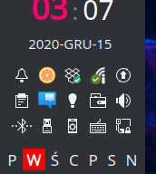

Weekday Widget for KDE
======================

Weekday Widget is a small widget for KDE that shows what the day is today in context of whole week. Once
installed, it just shows you grid of 7 cells, each one corresponding to sigle weekday, with current
day additionally marked:

---

## Configuration ##

 * **Localization**
   * **Use non default locale**: system wide (`C`) locale is used to construct day labels. Enable this option and specify name of installed locale (i.e. `en_US`) you want to be used for constructing day labels instead.
   * **Use noo default week start day**: first day of the week is obtained from system or specified locale. Enable this option to set that day manually.

---

## Installation ##

Download `*.plasmoid` file from [project Release section](https://github.com/MarcinOrlowski/weekday-plasmoid/releases).
Then you can either install it via Plasmashell's GUI, by clicking RMB over your desktop or panel and selecting
"Add widgets", then "Get new widgets..." eventually choosing "Install from local file..." and pointing to downloaded
`*.plasmoid` file.

Alternatively you can install it using your terminal, with help of `kpackagetool5`:

    kpackagetool5 --install /PATH/TO/DOWNLOADED/weekday.plasmoid 

## Upgrading ##

If you already have widget running and there's newer release your want to install, use `kpackagetool5`
with `--upgrade` option. This will update current installation while keeping your settings intact:

    kpackagetool5 --upgrade /PATH/TO/DOWNLOADED/weekday.plasmoid

**NOTE:** Sometimes, due to Plasma internals, newly installed version may not be instantly seen working,
so you may want to convince Plasma by doing manual reload:

    kquitapp5 plasmashell && kstart5 plasmashell
    
**NOTE:** this will **NOT** log you out nor affects any other apps. 

---

## License ##

 * Written and copyrighted &copy;2020 by Marcin Orlowski <mail (#) marcinorlowski (.) com>
 * Weekday Widget is open-sourced software licensed under the [MIT license](http://opensource.org/licenses/MIT)

