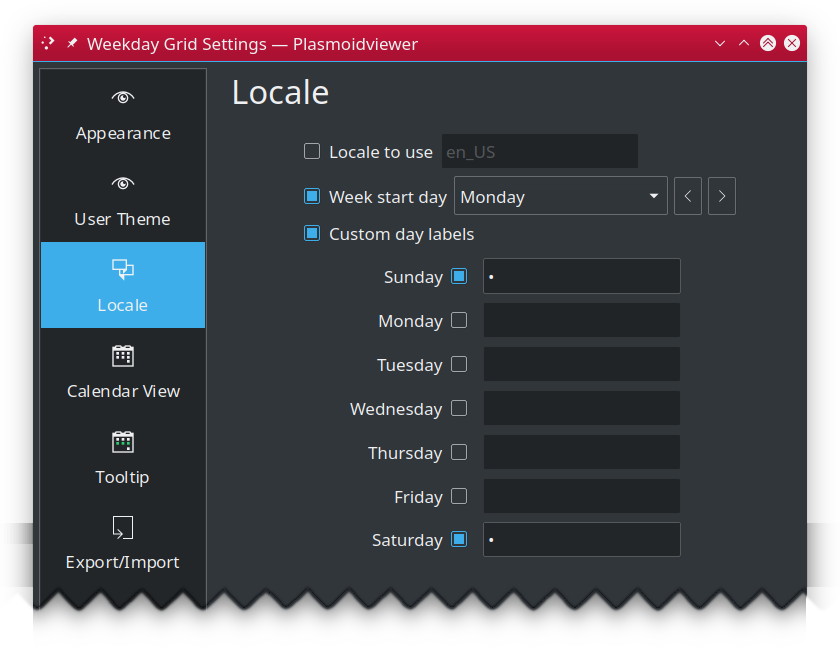
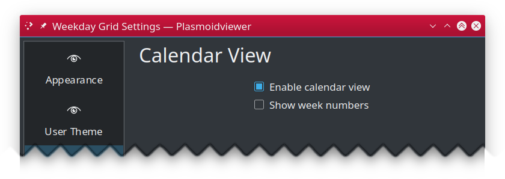
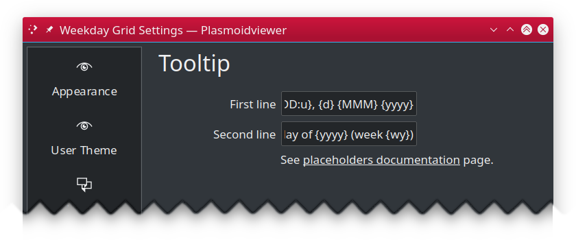

Weekday Grid Widget for KDE
===========================

Weekday Grid is a small widget for KDE that shows what the day is today in context of whole week by rendering small
horizontal 7 cells grid, one for each week day and visually distinguishing day of today with past and future
week days. 

---

## Table of Contents ##

 * [Configuration](#configuration)
   * [Appearance](#appearance)
   * [Locale](#locale)
   * [Calendar View](#calendar-view)
   * [Tooltip](#tooltip)
   * [Import/Export](#import-export)
 * [Installation](#installation)
   * [Using built-in installer](#using-built-in-installer)
   * [Manual installation](#manual-installation)
 * [Upgrading](#upgrading)
 * [Related links](#related-links)
 * [Changelog](CHANGES.md)
 * [License](#license)

---

## Configuration ##

### Appearance ###

Allows you to select one of predefined color theme create own color style, either from scratch or using existing
theme as your starting point.

 * **Theme**: changes widget color theme. Switch to "Custom colors" to use own colors.
 * **Clone**: Copies colors from currently set theme to custom color editior.

#### Theme items ####

 * **Widget**: specifies general widget background color. 
 * **Month last day**: optional month separator bar, drawn after last day of the current month.
 * **Today**: appearance of current day
 * **Today Saturday**: optional, separate appearance of current day if it is Saturday. If not enabled "Today" is used.
 * **Today Sunday**: optional, separate appearance of current day if it is Sunday. If not enabled, "Today" is used.
 * **Past**: appearance of past week days
 * **Past Saturday**: optional, separate appearance of past Saturday. If not enabled, "Past" is used.
 * **Past Sunday**: optional, separate appearance of past Sunday. If not enabled, "Past" is used.
 * **Future**: appearance of remaining, future days of the week.
 * **Furure Saturday**: optional, separate appearance of future Saturday. If not enabled, "Future" will be used.
 * **Future Sunday**: optional, separate appearance of future Sunday. If not enabled, "Future" will be used.

#### Item settings ####

 1. Configuration item label,
 1. On/Off switch for optional configuration items,
 1. Background color,
 1. Swaps Background <-> Foreground colors,
 1. Foreground (text) color,
 1. Boldface appearance on/off switch,
 1. Italic appearance on/off switch,
 1. Copy all item attributes to internal clipboard,
 1. Paste attributes from internal clipboard.

**NOTES:** 
 * For each color you can specify transparency ("alpha channel") from `0` meaning full transparency, to `255` meaning full opaque.
 * Colors are **layered** to allow fancy configuration. Widget general background color is **always** drawn for each day then it is overlaid
   by background color as set for specific type of day.
 * If you do not want color mixing to happen, ensure top layer color's transparency is set to `255` (full opaque).
 * If you enable separate configuration for "Future Saturday" and "Future Sunday", background color set for "Future days" will not be used.

### Locale ###

 * **Use non default locale**: system wide (`C`) locale is used to construct day labels. Enable this option and specify name of installed
   locale (i.e. `en_US`) you want to be used for constructing day labels instead.
 * **Use non default week start day**: first day of the week is obtained from system or specified locale. Enable this option to set that day manually.

### Calendar View ###

 * **Enabled calendar view**: uncheck to disable calendar view popup from showing up on widget click.
 * **Show week numbers**: specifies if popup calendar view should also show week numbers.

### Tooltip ###

 * **Main text**: template for main tooltip text line.
 * **Sub text**: template for tooltip subtext line.

### Export/Import ###

 * **Export to JSONt**: Exports user custom colors as JSON string.
 * **Import from JSON**: Imports theme settings from JSON string.

#### Supported placeholders ####

 Your formatting string can contain anything you like, however certain sequences are considered
 placeholders, and will be replaced by corresponding values. Non-placeholders are left unaltered.

| Placeholder | Description |
|-------------|-------------|
| %yyyy% 	| long year (i.e. "2009") |
| %yy% 		| short year (i.e. "09") |
| %MMM%		| long month name (i.e. "January") |
| %MM%		| abbreviated month name (i.e. "Jan") |
| %M%		| first letter month name (i.e. "J") |
| %mm%		| zero prefixed 2 digit month number ("02" for Feb, "12" for Dec) |
| %m%		| month number as is ("2" for Feb, "12" for Dec) |
| %DDD%		| full day name (i.e. "Saturday", "Sunday", "Monday") |
| %DD%		| abbreviated day name ("Sat", "Sun", "Mon") |
| %D%		| first letter day name ("S", "S", "M") |
| %dd%		| zero prefixed 2 digit day number ("01", "27") |
| %d%		| day number as is ("1", "27") |
| %dy%		| day number of the year (i.e. "250") |
| %dw%		| day number in week (i.e. "1" for Monday **if** weeks start on Mondays!) |
| %wy%		| week of the year (i.e. "1" or "53") |
| %hh%		| current hour, zero prefixed, 24hrs clock (i.e. "01", "16") |
| %h%		| current hour, 24hrs clock (i.e. "1", "16") |
| %kk%		| current hour, zero prefixed, 12hrs clock (i.e. "01", "11") |
| %k%		| current hour, 12hrs clock (i.e. "1", "11") |
| %ii%		| current minute, zero prefixed (i.e. "01", "35") |
| %i%		| current minute, zero prefixed (i.e. "1", "35") |
| %AA%		| upper-cased AM/PM marker (i.e. "AM") |
| %A%		| upper-cased abbreviated AM/PM marker. "A" for "AM", "P" for "PM" |
| %aa%		| lower-cased am/pm marker (i.e. "am") |
| %a%		| lower-cased abbreviated AM/PM marker. "a" for "am", "p" for "pm" |
| %Aa%		| AM/PM marker with first letter uppercased (i.e. "Am"/"Pm") |
| %t%		| Name of currently used timezone (i.e. "UTC") |

 For example, `Today is %DDD%` will produce `Today is Sunday` (assuming today is named "Sunday").

 You can also use optional formatting directives. The syntax is `%PLACEHOLDER:DIRECTIVE%`
 and supported directives are:

| Directive | Description |
|-------------|-------------|
| U	| turns whole placeholder uppercased (i.e. "%DD:U%" => "SAT") |
| L | turns whole placeholder lowercased (i.e. "%DD:L%: => "sat") |
| u | turns first letter of placeholder uppercased, all remaining are left unaltered. This is useful when i.e. weekday or month names are usually lowercased in your language but you'd like to have it other way. I.e. for Polish localization, "%DDD%" can produce "wtorek" for Tuesday. With "%DDD:u%" you would get "Wtorek" instead. |
| 00 | ensures placeholder values is **at last** two characters long by adding leading zeros to sorter strings. Makes use for numer values only. **NOTE:** values longer than two characters will not be trimmed. Also note zeroes will be prepended to any short value, even if that would make no much sense, i.e. `%D:00%` produce `0M` on Mondays. |

 **NOTE:** at the moment, formatting directives cannot be combined.

---

## Installation ##

You should be able to install Weekday Grid widget either using built-in Plasma Add-on installer or manually, by
downloading `*.plasmoid` file either from project [Github repository](https://github.com/MarcinOrlowski/weekday-plasmoid/) or
from [KDE Store](https://store.kde.org/p/1460393/)

### Using built-in installer ###

To install widget using Plasma built-in mechanism, press right mouse button over your desktop or panel and select 
"Add Widgets..." from the context menu, then "Get new widgets..." eventually choosing "Download New Plasma Widgets...".
Then search for "Weekday Grid" in "Plasma Add-On Installer" window.

### Manual installation ###

Download `*.plasmoid` file from [project Release section](https://github.com/MarcinOrlowski/weekday-plasmoid/releases).
Then you can either install it via Plasmashell's GUI, by clicking right mouse button over your desktop or panel and
selecting "Add widgets...", then "Get new widgets..." eventually choosing "Install from local file..." and pointing to downloaded
`*.plasmoid` file.

Alternatively you can install it using your terminal, with help of `kpackagetool5`:

    kpackagetool5 --install /PATH/TO/DOWNLOADED/weekday.plasmoid 

## Upgrading ##

If you already have widget running and there's newer release your want to install, use `kpackagetool5`
with `--upgrade` option. This will update current installation while keeping your settings intact:

    kpackagetool5 --upgrade /PATH/TO/DOWNLOADED/weekday.plasmoid

**NOTE:** Sometimes, due to Plasma internals, newly installed version may not be instantly seen working,
so you may want to convince Plasma by doing manual reload:

    kquitapp5 plasmashell && kstart5 plasmashell
    
**NOTE:** this will **NOT** log you out nor affects any other apps. 

---

## Related links ##

 * [KDE store project page](https://store.kde.org/p/1460393/) 

---

## License ##

 * Written and copyrighted &copy;2020-2021 by Marcin Orlowski <mail (#) marcinorlowski (.) com>
 * Weekday Grid widget is open-sourced software licensed under the [MIT license](http://opensource.org/licenses/MIT)

