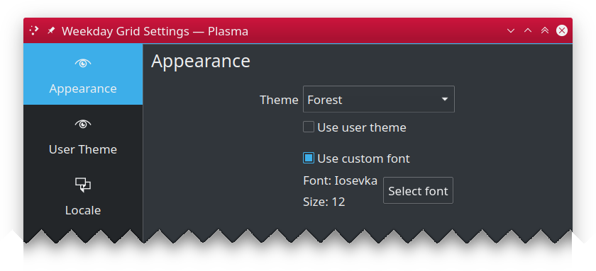
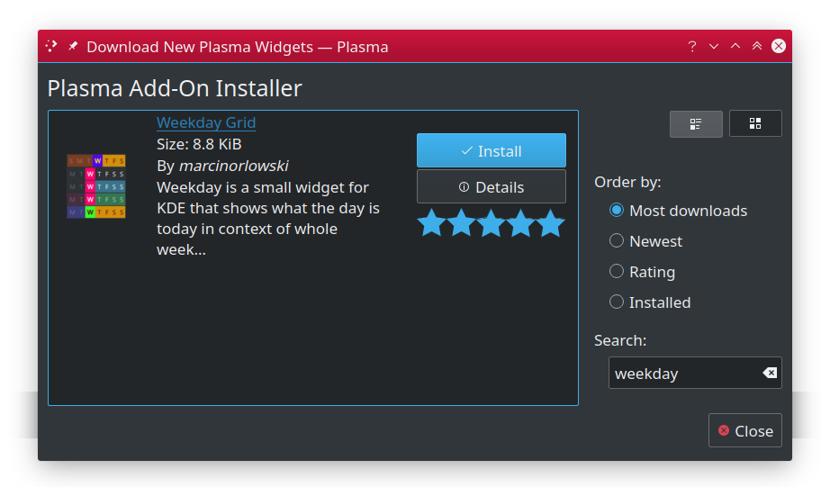

Weekday Grid Widget for KDE
===========================

Weekday Grid is a small widget for KDE that shows what the day is today in context of whole week by rendering small
horizontal 7 cells grid, one for each week day and visually distinguishing day of today with past and future
week days. 

---

## Table of Contents ##

 * [Configuration](#configuration)
   * [Appearance](#appearance)
   * [Locale](#locale)
 * [Installation](#installation)
   * [Using built-in installer](#using-built-in-installer)
   * [Manual installation](#manual-installation)
 * [Upgrading](#upgrading)
 * [Related links](#related-links)
 * [Changelog](CHANGES.md)
 * [License](#license)

---

## Configuration ##

### Appearance ###

 * **Use custom colors**: enable to override default appearance.
   * **Past days**: appearance of past week days
   * **Today**: appearance of current day
   * **Future days**: appearance of remaining, future days of the week.

### Locale ###

 * **Use non default locale**: system wide (`C`) locale is used to construct day labels. Enable this option and specify name of installed locale (i.e. `en_US`) you want to be used for constructing day labels instead.
 * **Use noo default week start day**: first day of the week is obtained from system or specified locale. Enable this option to set that day manually.

---

## Installation ##

You should be able to install Weekday Grid widget either using built-in Plasma Add-on installer or manually, by
downloading `*.plasmoid` file either from project [Github repository](https://github.com/MarcinOrlowski/weekday-plasmoid/) or from [KDE Store](https://store.kde.org/p/1460393/)

### Using built-in installer ###

To install widget using Plasma built-in mechanism, press right mouse button over your desktop or panel and select 
"Add Widgets..." from the context menu, then "Get new widgets..." eventually choosing "Download New Plasma Widgets...".
Then search for "Weekday Grid" in "Plasma Add-On Installer" window.

### Manual installation ###

Download `*.plasmoid` file from [project Release section](https://github.com/MarcinOrlowski/weekday-plasmoid/releases).
Then you can either install it via Plasmashell's GUI, by clicking right mouse button over your desktop or panel and
selecting "Add widgets...", then "Get new widgets..." eventually choosing "Install from local file..." and pointing to downloaded
`*.plasmoid` file.

Alternatively you can install it using your terminal, with help of `kpackagetool5`:

    kpackagetool5 --install /PATH/TO/DOWNLOADED/weekday.plasmoid 

## Upgrading ##

If you already have widget running and there's newer release your want to install, use `kpackagetool5`
with `--upgrade` option. This will update current installation while keeping your settings intact:

    kpackagetool5 --upgrade /PATH/TO/DOWNLOADED/weekday.plasmoid

**NOTE:** Sometimes, due to Plasma internals, newly installed version may not be instantly seen working,
so you may want to convince Plasma by doing manual reload:

    kquitapp5 plasmashell && kstart5 plasmashell
    
**NOTE:** this will **NOT** log you out nor affects any other apps. 

---

## Related links ##

 * [KDE store project page](https://store.kde.org/p/1460393/) 

---

## License ##

 * Written and copyrighted &copy;2020 by Marcin Orlowski <mail (#) marcinorlowski (.) com>
 * Weekday Grid widget is open-sourced software licensed under the [MIT license](http://opensource.org/licenses/MIT)

