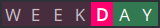
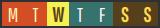
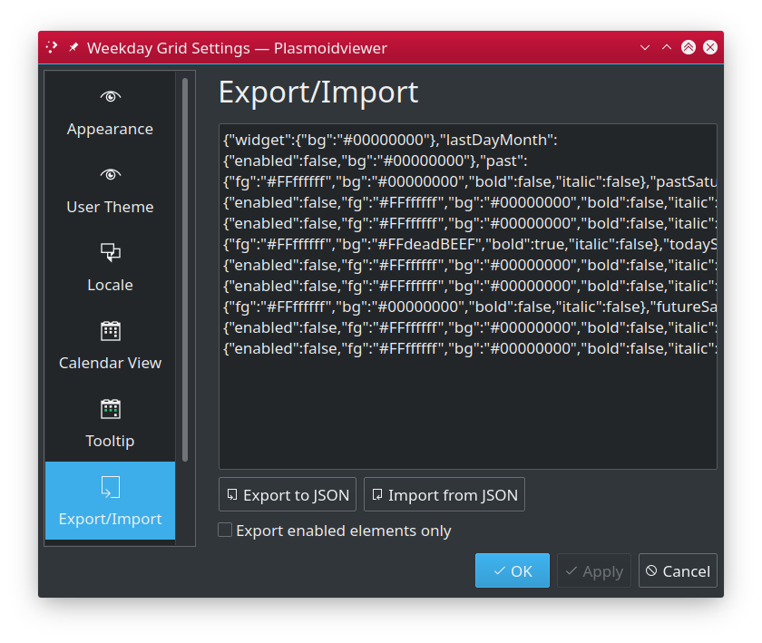

# Weekday Grid widget for KDE #

Weekday Grid is a small widget for KDE that sits in your panel and its main role is to show you what the day is today
in context of whole week. While it may sound bit odd at first, widget renders small, horizontal, 7 cells grid, one cell
for each day of current and then visually marks them distinguish day of today, past and future and weekends and even
marks last day of the month. This lets you instantly tell what day of the week it really is, not by name, but rather
by "location in time" which is suprisingly very helpful in time planing.

This is how it looks now, with Wednesday being current day and widget configured with Monday as first day of the week:

---

## Features ##

* Small and compact
* Fully themable
  * 25+ built-in color themes
  * Custom font support
  * Custom theme editor
  * Separate color settings for
    * Past, Today and Future days
    * Optional separate setup for weekends
    * Optional marker for last day of the month
    * Multilayer color blending
* Locale aware with ability to override
  * First day of the week
  * Week day labels
* Fully configurable widget tooltip
* Themes export/import
* Free and open source.

---

## Table of Contents ##

* [Configuration](#configuration)
  * [Appearance](#appearance)
  * [User Theme](#user-theme)
  * [Locale](#locale)
  * [Calendar View](#calendar-view)
  * [Tooltip](#tooltip)
  * [Export/Import](#exportimport)
* [Custom themes](#custom-themes)
  * [Testing with fake parameters](#testing-with-fake-parameters)
  * [Testing checklist](#testing-checklist)
* [Installation](#installation)
  * [Using built-in installer](#using-built-in-installer)
  * [Manual installation](#manual-installation)
* [Upgrading](#upgrading)
* [Additional resources](#additional-resources)
* [Changelog](CHANGES.md)
* [License](#license)

---

## Configuration ##

Weekday Grid widget is very flexible and configurable by design. Almost all aspects of its look and behavior can be modified
to fit your needs.

### Appearance ###

Allows you to select one of predefined color theme or use custom color styles, as defined in "User Theme" pane.

* **Theme**: selects widget built-in color theme.
* **Use user theme**: uses [user theme](#user-theme) colors, instead of built-in theme.
* **Use custom font**: enables use of custom font (and its size) instead of theme default.
  * **Select font**: opends font dialog to select new typeface to use. You can also specify font size.

>  However font selector allows you to specify multiple font attributes, styles
> (i.e. bold) and effects like underline or strikethru, these are ignored intentionally to avoid conflict
> with theme attributes. Only font family and font size matters.

---

### User Theme ###

Allows you to create own color style, either from scratch or using existing theme as your starting point.

* **Clone this theme**: Copies colors from selected source built-in theme to custom color editior.

#### Theme items ####

* **Widget**: specifies general widget background color. 
* **Month last day**: optional month separator bar, drawn after last day of the current month.
* **Today**: appearance of current day
* **Today Saturday**: optional, separate appearance of current day if it is Saturday. If not enabled "Today" is used.
* **Today Sunday**: optional, separate appearance of current day if it is Sunday. If not enabled, "Today" is used.
* **Past**: appearance of past week days
* **Past Saturday**: optional, separate appearance of past Saturday. If not enabled, "Past" is used.
* **Past Sunday**: optional, separate appearance of past Sunday. If not enabled, "Past" is used.
* **Future**: appearance of remaining, future days of the week.
* **Furure Saturday**: optional, separate appearance of future Saturday. If not enabled, "Future" will be used.
* **Future Sunday**: optional, separate appearance of future Sunday. If not enabled, "Future" will be used.

**NOTE:** Options present in "Fake parameters" group are documented in [Custom themes](#custom-themes) chapter.

#### Item settings ####

 1. Configuration item label,
 1. On/Off switch for optional theme elements,
 1. Text color,
 1. Swaps Background <-> Text colors,
 1. Cell background color,
 1. Boldface appearance on/off switch,
 1. Italic appearance on/off switch,
 1. Copy all item attributes to internal clipboard,
 1. Paste attributes from internal clipboard.

**NOTES:** 
* For each color you can specify transparency ("alpha channel") from `0` meaning full transparency, to `255` meaning full opaque.
* Colors are **layered** to allow fancy configuration. Widget general background color is **always** drawn for each day then it is overlaid
  by background color as set for specific type of day.
* If you do not want color mixing to happen, ensure top layer color's transparency is set to `255` (full opaque).
* If you enable separate configuration for "Future/Past Saturday/Sunday", corresponding background color set for "Future/Past" will not
  be used and cell colors will only be blended with default widget background color.

---

### Locale ###

Allows you to configure locale used by the widget.

* **Locale to use**: By default, the system wide locale settings are used while creating day labels. If you want to override this (i.e. have English
  originated day labels while your whole system uses different language, enable this option and put name of locale of your choice (i.e. `pl` or `en_GB`).
  Ensure such locale is available in your system.
* **Week start day**: By default, the first day of the week is obtained from system or specified locale, which usually means either Sunday or Monday,
  depending on localization used. If you want to have it set differently, enable this option and set that day manually.
* **Custom day labels**: Enable this option to use own labels for any of the week days. You can use any character (incl. unicode) that is supported by fonts you use.
  * **Sunday**: enable to use own label for Sunday. Label can be one character only or empty string.
  * **Monday**: enable to use own label for Monday. Label can be one character only or empty string.
  * **Tuesday**: enable to use own label for Tuesday. Label can be one character only or empty string.
  * **Wednesday**: enable to use own label for Wednesday. Label can be one character only or empty string.
  * **Thursday**: enable to use own label for Thursday. Label can be one character only or empty string.
  * **Friday**: enable to use own label for Friday. Label can be one character only or empty string.
  * **Saturday**: enable to use own label for Saturday. Label can be one character only or empty string.

---

### Calendar View ###

Configures built-in calendar view, shown (by default) on widget tap.

* **Enabled calendar view**: uncheck to disable calendar view popup from showing up on widget click.
* **Show week numbers**: specifies if popup calendar view should also show week numbers.

---

### Tooltip ###

Configures widget tooltip information, shown when you hoover over the widget.

* **Main text**: template for main tooltip text line.
* **Sub text**: template for tooltip subtext line.

#### Supported placeholders ####

 Your formatting string can contain anything you like, however certain sequences are considered
 placeholders, and will be replaced by corresponding values. Non-placeholders are left unaltered.

| Placeholder | Description |
|-------------|-------------|
| {yyyy} 	| long year (i.e. "2009") |
| {yy} 		| short year (i.e. "09") |
| {MMM}		| long month name (i.e. "January") |
| {MM}		| abbreviated month name (i.e. "Jan") |
| {M}		| first letter month name (i.e. "J") |
| {mm}		| zero prefixed 2 digit month number ("02" for Feb, "12" for Dec) |
| {m}		| month number as is ("2" for Feb, "12" for Dec) |
| {DDD}		| full day name (i.e. "Saturday", "Sunday", "Monday") |
| {DD}		| abbreviated day name ("Sat", "Sun", "Mon") |
| {D}		| first letter day name ("S", "S", "M") |
| {dd}		| zero prefixed 2 digit day number ("01", "27") |
| {d}		| day number as is ("1", "27") |
| {dy}		| day number of the year (i.e. "250") |
| {dw}		| day number in week (i.e. "1" for Monday **if** weeks start on Mondays!) |
| {wy}		| week of the year (i.e. "1" or "53") |
| {hh}		| current hour, zero prefixed, 24hrs clock (i.e. "01", "16") |
| {h}		| current hour, 24hrs clock (i.e. "1", "16") |
| {kk}		| current hour, zero prefixed, 12hrs clock (i.e. "01", "11") |
| {k}		| current hour, 12hrs clock (i.e. "1", "11") |
| {ii}		| current minute, zero prefixed (i.e. "01", "35") |
| {i}		| current minute, zero prefixed (i.e. "1", "35") |
| {ss}		| current second, zero prefixed (i.e. "01", "35") |
| {s}		| current second (i.e. "1", "35") |
| {AA}		| upper-cased AM/PM marker (i.e. "AM") |
| {A}		| upper-cased abbreviated AM/PM marker. "A" for "AM", "P" for "PM" |
| {aa}		| lower-cased am/pm marker (i.e. "am") |
| {a}		| lower-cased abbreviated AM/PM marker. "a" for "am", "p" for "pm" |
| {Aa}		| AM/PM marker with first letter uppercased (i.e. "Am"/"Pm") |
| {t}		| Name of currently used timezone (i.e. "UTC") |
| {ldl}		| Locale based date long format |
| {lds}		| Locale based date short format |
| {ltl}		| Locale based time long format |
| {lts}		| Locale based time short format |
| {ldtl}	| Locale based date and time long format |
| {ldts}	| Locale based date and time short format |

 For example, `Today is {DDD}` will produce `Today is Sunday` (assuming today is named "Sunday").

 You can also use optional formatting directives. The syntax is `{PLACEHOLDER:DIRECTIVE}`
 and supported directives are:

| Directive | Description |
|-------------|-------------|
| U | Turns whole placeholder uppercased (i.e. "{DD:U}" => "SAT") |
| L | Turns whole placeholder lowercased (i.e. "{DD:L}" => "sat") |
| u | Turns first letter of placeholder uppercased, leaving remaining part unaltered. This is useful when i.e. weekday or month names are usually lowercased in your language but you'd like to have it other way. I.e. for Polish localization, "{DDD}" can produce "wtorek" for Tuesday. With "{DDD:u}" you would get "Wtorek" instead. |
| 00 | Ensures placeholder value is **at last** two characters long by adding leading zeros to sorter strings. Makes use for numer values only. **NOTE:** values longer than two characters will not be trimmed. Also note zeroes will be prepended to any short value, even if that would make no much sense, i.e. `{D:00}` produce `0M` on Mondays. |

 **NOTE:** at the moment, formatting directives cannot be combined.

---

### Export/Import ###

Allows you to export or import your theme.

* **Export to JSON**: Exports user custom colors as JSON string.
* **Import from JSON**: Imports theme settings from JSON string.
* **Export enabled elements only**: When checked, will export optional theme elements (like i.e. `Past Saturday`) only
  if it is enabled for being used by the theme, which makes exported JSON smaller.

---

## Custom themes ##

To allow you to widely test your theme configuration for variety of cases (see suggested checklist below), "Theme" configuration
pane offers ability to use "fake" parameters for easier testing.

### Testing with fake parameters ###

To make theme testing easier you can enable "Use fake parameters" feature and manually configure several parameters normally obtained
from the calendar and set it to any values helpful for testing  that would otherwise not ever occur (i.e. week starts on Wednesday).
Currently "Use fake parameters" option overrides include:

* **Fake Today**: Specify what day you want to be considered "Today".
* **Fake month last day**: Tricks widget into believing month ends in week being displayed and lets you specify the last day
  of the month. Helpful while testing "Month last day" theme marker
* **Fake week start day**: Set your fake first day of the week.

**NOTE:** Both "Fake Today" and "Fake month last day" feature previous/next navigation buttons. These will automatically commit
"Use Fake Calendar" option as enabled. This may not be reflected by "Apply" button so hitting "Cancel" will not disable
fake calendar feature. You need to uncheck this option and "Apply" or, in case you made more changes to the settings you do
not want to apply, close and reopen settings window, then uncheck "Use Fake Calendar" and "Apply" to disable it.

### Testing checklist ###

While testing your theme, the following cases should be validated. The following checklist assumes
Monday is first day of the week (thus occupies first cell in the grid), the last is Sunday. This
only matters for testing.

 1. Today in Wednesday: see if past and future days differ from Today.
 1. If using separate style for Saturday/Sunday:
    1. Set Today to Friday and see if weekend is visually different from Today and past days.
    1. Set Today to Sunday to see if weekdays differ from Saturday.
 1. If using separate style for Past Saturday/Sunday:
    1. Set week to start on Wednesday, so weekend days are in the middle of grid.
 1. If using end of the month marker:
    1. Set both Today and Last Month Day to the same day to ensure it won't blend.
    1. Set Last Month Day to Monday, Friday and Saturday to see if it is still clearly visible.
    1. Set Last Month Day to Tuesday and Today to Wednesday to see if it is still visible.

---

## Installation ##

You should be able to install Weekday Grid widget either using built-in Plasma Add-on installer or manually, by
downloading `*.plasmoid` file either from project [Github repository](https://github.com/MarcinOrlowski/weekday-plasmoid/) or
from [KDE Store](https://store.kde.org/p/1460393/)

### Using built-in installer ###

To install widget using Plasma built-in mechanism, press right mouse button over your desktop or panel and select
`Add Widgets...` from the context menu, then `Get new widgets...` eventually choosing `Download New Plasma Widgets...`.
Then search for `Weekday Grid` in `Plasma Add-On Installer` window:

### Manual installation ###

Download `*.plasmoid` file from [project Release section](https://github.com/MarcinOrlowski/weekday-plasmoid/releases).
Then you can either install it via Plasmashell's GUI, by clicking right mouse button over your desktop or panel and
selecting `Add widgets...`, then `Get new widgets...` eventually choosing `Install from local file...` and pointing to downloaded
`*.plasmoid` file.

Alternatively you can install it using your terminal, with help of `kpackagetool5`:

    kpackagetool5 --install weekday.plasmoid 

## Upgrading ##

If you already have widget running and there's newer release your want to install, use `kpackagetool5`
with `--upgrade` option. This will update current installation while keeping your settings intact:

    kpackagetool5 --upgrade weekday.plasmoid

**NOTE:** Sometimes, due to Plasma internals, newly installed version may not be instantly seen working,
so you may want to convince Plasma by doing manual reload:

    kquitapp5 plasmashell ; kstart5 plasmashell

**NOTE:** this will **NOT** log you out nor affects any other apps.

---

## Additional resources ##

* [Weekday Grid widget in KDE Store](https://store.kde.org/p/1460393/)
* [Plasmoid developer helper tools](https://github.com/marcinorlowski/plasmoid-tools)
* [Coolors (color palete generator)](https://coolors.co/)

---

## License ##

* Written and copyrighted &copy;2020-2023 by Marcin Orlowski <mail (#) marcinorlowski (.) com>
* Weekday Grid widget is open-sourced software licensed under the [MIT license](http://opensource.org/licenses/MIT)
